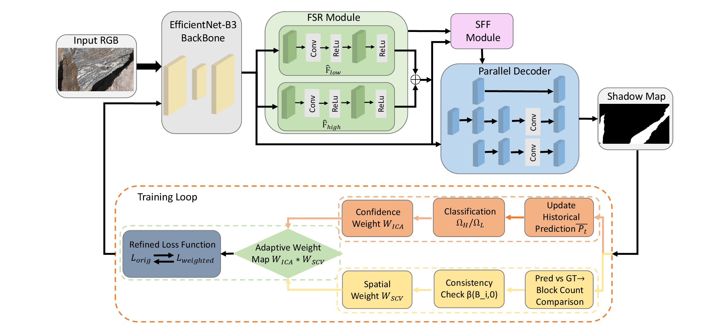
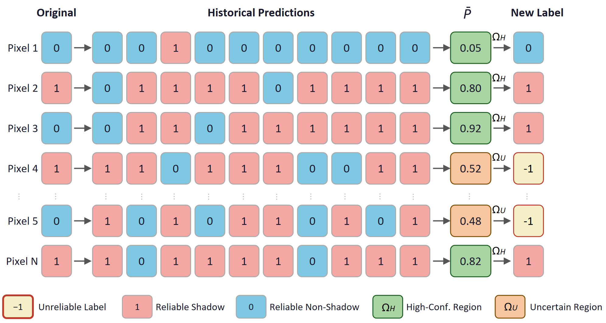
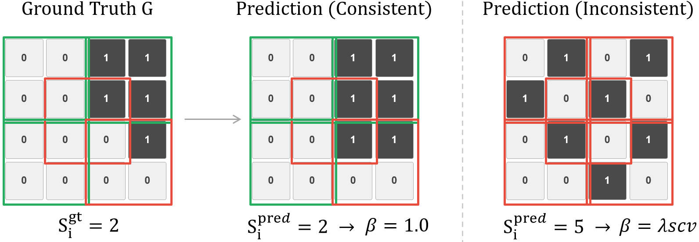

# Self-Calibrated Shadow Detection with Spatial Consistency Constraints under Noisy Labels

This repository accompanies the manuscript submitted to *The Visual Computer*. It currently provides the paper overview and key framework illustrations. The training and evaluation code, configuration files, and model checkpoints are being organized and will be released after internal cleanup.

## Abstract

Deep learning-based shadow detection has advanced considerably, yet performance remains limited by annotation noise and imprecise boundary predictions in real-world datasets. This paper presents a robust shadow detection framework designed to mitigate the adverse effects of unreliable training labels and preserve spatial structural consistency. The proposed approach integrates three complementary mechanisms: **Iterative Confidence Aggregation (ICA)**, **Spatial Consistency Verification (SCV)**, and **Boundary Refined Loss Function (BRLF)**. Compared with the SDDNet baseline, our method reduces BER by **8.16%** on SBU and **10.24%** on ISTD, while achieving state-of-the-art performance on SBU and UCF.

## Code Availability

The source code is not included in this initial public repository yet. We are cleaning the training scripts, evaluation protocol, configuration files, and pretrained checkpoints to make the release reproducible and easy to use.

Planned release contents:

- training and evaluation code;
- dataset preparation instructions for SBU, ISTD, UCF, and ViSha;
- configuration files for the reported experiments;
- pretrained model checkpoints;
- instructions for reproducing the main quantitative results.

The repository will be updated once these files are ready for public release.

## Framework

The proposed framework consists of three complementary components built upon SDDNet:

- **ICA** — Iterative Confidence Aggregation: accumulates historical predictions via EMA to identify unreliable pixels and downweight their supervision.
- **SCV** — Spatial Consistency Verification: evaluates local boundary structure consistency to suppress supervision in spatially inconsistent regions.
- **BRLF** — Boundary Refined Loss Function: periodically switches between the original SDDNet loss and the weighted loss to balance disentanglement stability and reliability-weighted supervision.

### ICA Mechanism

For each pixel, historical predictions are aggregated via EMA into a confidence score, which determines whether the pixel belongs to the high-confidence region or uncertain region. Unreliable pixels are downweighted during training.

### SCV Mechanism

For each local 4x4 region, boundary-containing 2x2 blocks are counted in both the ground truth and the binarized prediction. When significant disagreement is detected, the supervision weight is reduced.

## Results

### Quantitative Comparison (BER ↓)

| Method | Venue | ISTD | SBU | UCF |
|--------|-------|:----:|:---:|:---:|
| SDDNet | MM'23 | 1.27 | 2.94 | 5.29 |
| SILT | ICCV'23 | 1.16 | 4.19† | 7.23† |
| AdapterShadow | ESWA'25 | **0.86** | 2.75 | 6.60 |
| **Ours** | — | <u>1.14</u> | **2.70** | **6.20** |

Bold: best. Underline: second best.
†SILT evaluates on the re-annotated SBU-Refine test set and is not directly comparable.

Our method achieves state-of-the-art BER on SBU and UCF, and competitive performance on ISTD.
